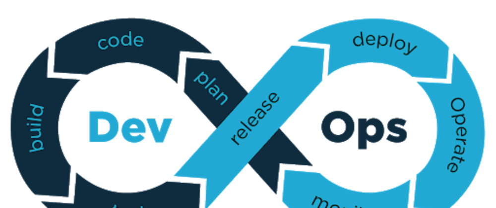
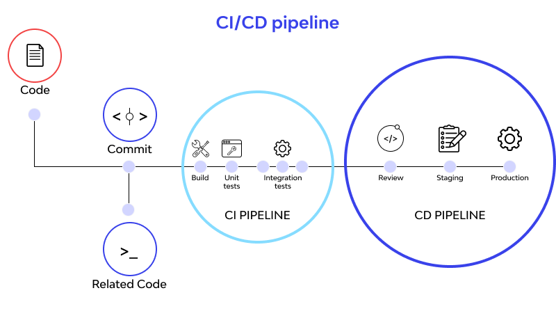
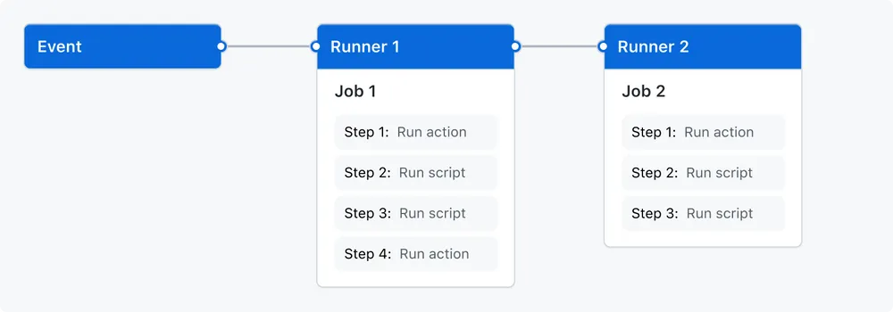
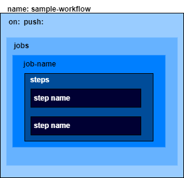

# What's about DevOps



CI and CD stand for continuous integration and continuous delivery/continuous deployment. In very simple terms, CI is a modern software development practice in which incremental code changes are made frequently and reliably. Automated build-and-test steps triggered by CI ensure that code changes being merged into the repository are reliable. The code is then delivered quickly and seamlessly as a part of the CD process. In the software world, the CI/CD pipeline refers to the automation that enables incremental code changes from developers’ desktops to be delivered quickly and reliably to production.

# Why is CI/CD important?

CI/CD allows organizations to ship software quickly and efficiently. CI/CD facilitates an effective process for getting products to market faster than ever before, continuously delivering code into production, and ensuring an ongoing flow of new features and bug fixes via the most efficient delivery method. 



---

# Git-hup action

Automate, customize, and execute your software development workflows right in your repository with GitHub Actions. You can discover, create, and share actions to perform any job you'd like, including CI/CD, and combine actions in a completely customized workflow.


Workflows
A workflow is a configurable automated process that will run one or more jobs. Workflows are defined by a YAML file checked in to your repository and will run when triggered by an event in your repository, or they can be triggered manually, or at a defined schedule.

Workflows are defined in the .github/workflows directory in a repository, and a repository can have multiple workflows, each of which can perform a different set of tasks. For example, you can have one workflow to build and test pull requests, another workflow to deploy your application every time a release is created, and still another workflow that adds a label every time someone opens a new issue.




## Example code

```yaml
name: example-flow
run-name: ${{ github.actor }} is learning GitHub Actions
on: [push]
jobs:
  check-bats-version:
    runs-on: ubuntu-latest
    steps:
      - name: check server-info
        run: lsb-relases -a
      - name: display wording
        run: echo hello ${{ github.actor }}

```



### workshop-1

> how shloud we made the multiple jobs


### workshop-2

> Create your workflow for build your docker images and push to the registry on your own


---
content ref. https://docs.github.com/en/actions/learn-github-actions/understanding-github-actions