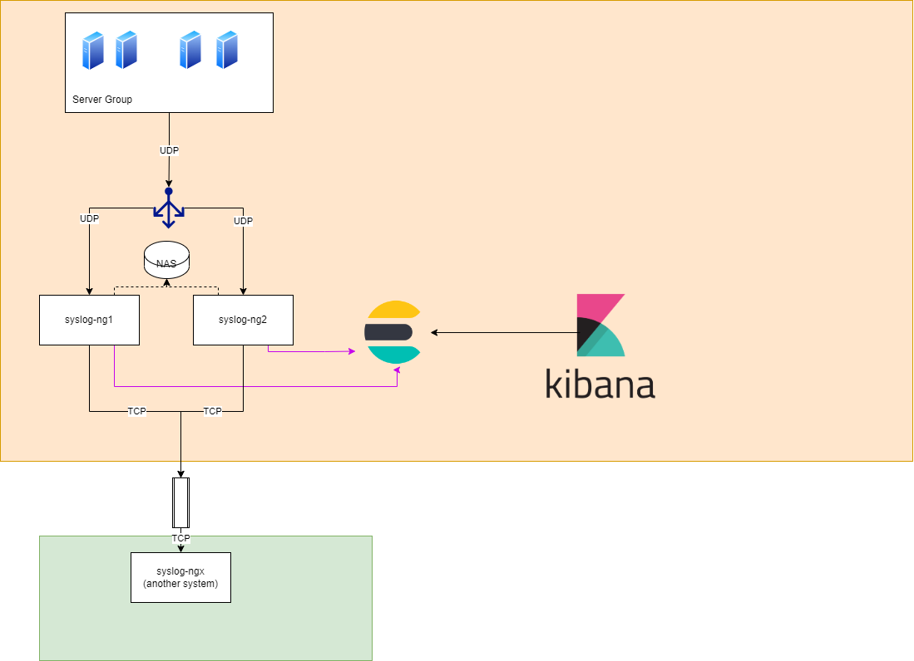

# Log server ng as cluster mode



This architecture we talking about syslogs server as multiple node on multi region (green, orange)

syslog-ng1 and syslog-ng2 are dedicated server (VMs) and install the syslog ng by recommend

ref. https://www.syslog-ng.com/technical-documents/doc/syslog-ng-open-source-edition/3.20/administration-guide/10#TOPIC-1121804


## You can run the server with docker container

```bash
docker run -d   --name=syslog-ng-1   -e PUID=1000   -e PGID=1000   -e TZ=Etc/UTC   -p 1514:5514/udp   -p 1601:6601/tcp  -p 
16514:6514/tcp   -v /app/syslogs-ng/sys-node-1/config:/config   -v /app/syslogs-ng/logs:/var/log `#optional`   --restart unless-stopped   lscr.io/linuxserver/syslog-ng:latest

docker run -d   --name=syslog-ng-2   -e PUID=1000   -e PGID=1000   -e TZ=Etc/UTC   -p 2514:5514/udp   -p 2601:6601/tcp  -p 
26514:6514/tcp   -v /app/syslogs-ng/sys-node-2/config:/config   -v /app/syslogs-ng/logs:/var/log `#optional`   --restart unless-stopped   lscr.io/linuxserver/syslog-ng:latest

docker run -d   --name=syslog-ng-x   -e PUID=1000   -e PGID=1000   -e TZ=Etc/UTC   -p 3514:5514/udp   -p 3601:6601/tcp  -p 
36514:6514/tcp   -v /app/syslogs-ng/sys-node-x/config:/config   -v /app/syslogs-ng/sys-node-x/log:/var/log `#optional`   --restart unless-stopped   lscr.io/linuxserver/syslog-ng:latest

```

In This Workshop syslog-ng1 and syslog-ng2 are docker container, There write out the logs to file in share path '/app/syslog-ng/logs'


syslog-ng.conf as syslogs-ng1

```bash
#############################################################################
# Default syslog-ng.conf file which collects all local logs into a
# single file called /var/log/messages tailored to container usage.

@version: 4.1
@include "scl.conf"

source s_local {
  internal();
};

source s_network_tcp {
  syslog(transport(tcp) port(6601));
};

source s_network_udp {
  syslog(transport(udp) port(5514));
};

destination d_cluster {
  file("/var/log/messages-kv.log" template("$ISODATE $HOST $(format-welf --scope all-nv-pairs)\n") frac-digits(3));        
};

destination d_remote {
    udp("10.x.x.x" port(3514));
};

log {
  source(s_local);
  source(s_network_tcp);
  source(s_network_udp);
  destination(d_cluster);
  destination(d_remote);
};
```

syslog-ng.conf as syslogs-ng2
```bash
#############################################################################
# Default syslog-ng.conf file which collects all local logs into a
# single file called /var/log/messages tailored to container usage.

@version: 4.1
@include "scl.conf"

source s_local {
  internal();
};

source s_network_tcp {
  syslog(transport(tcp) port(6601));
};

source s_network_udp {
  syslog(transport(udp) port(5514));
};

destination d_cluster {
  file("/var/log/messages-kv.log" template("$ISODATE $HOST $(format-welf --scope all-nv-pairs)\n") frac-digits(3));        
};

destination d_remote {
    udp("10.x.x.x" port(3514));
};

log {
  source(s_local);
  source(s_network_tcp);
  source(s_network_udp);
  destination(d_cluster);
};

```

and syslog-ngx we assume that is another server as the green side, it'll be recived the input from syslog-ng1 and syslog-ng2 and wirte out to the file in path '/app/syslogs-ng/sys-node-x/log'

syslog-ng.conf as syslogs-ngx

```bash
#############################################################################
# Default syslog-ng.conf file which collects all local logs into a
# single file called /var/log/messages tailored to container usage.

@version: 4.1
@include "scl.conf"

source s_local {
  internal();
};

source s_network_tcp {
  syslog(transport(tcp) port(6601));
};

source s_network_udp {
  syslog(transport(udp) port(5514));
};

destination d_cluster {
  file("/var/log/messages-kv.log" template("$ISODATE $HOST $(format-welf --scope all-nv-pairs)\n") frac-digits(3));        
};

destination d_remote {
    udp("10.138.36.250" port(3514));
};

log {
  source(s_local);
  source(s_network_tcp);
  source(s_network_udp);
  destination(d_cluster);
};
[root@DDSNLABA001G sys-node-1]# ls
config  log
[root@DDSNLABA001G sys-node-1]# cd ../
[root@DDSNLABA001G syslogs-ng]# ls
config  docker-compose.yaml  logs  start.bash  sys-node-1  sys-node-2  sys-node-x
[root@DDSNLABA001G syslogs-ng]# cat sys-node-x/config/syslog-ng.c
syslog-ng.conf  syslog-ng.ctl
[root@DDSNLABA001G syslogs-ng]# cat sys-node-x/config/syslog-ng.conf 
#############################################################################
# Default syslog-ng.conf file which collects all local logs into a
# single file called /var/log/messages tailored to container usage.

@version: 4.1
@include "scl.conf"

source s_local {
  internal();
};

source s_network_tcp {
  syslog(transport(tcp) port(6601));
};

source s_network_udp {
  syslog(transport(udp) port(5514));
};

destination d_cluster {
  file("/var/log/messages-kv.log" template("$ISODATE $HOST $(format-welf --scope all-nv-pairs)\n") frac-digits(3));        
};

log {
  source(s_local);
  source(s_network_tcp);
  source(s_network_udp);
  destination(d_cluster);
};

```