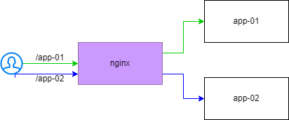

# public-laboratory
## Docker 400 Admin

### Pre-prerequisite

1. Register account hub.docker.com 

```
 docker lougin -u <user> 
 ```

1. Docker Runtime


### 0. Registration and Repository walkthrough [link here](https://hub.docker.com/signup)


### 1. Docker Build

a. Create new dockerfile


```Dockerfile 

FROM node

WORKDIR /app

ADD ./src/* .

RUN npm install express

CMD node server.js


 ```

b. Build new images by dockerfiles

```
docker build -t ${USER} .
```

c. Run your new container with new image

```
docker run --name myapp-01 -d -p 80:80 ${USER} 
```

d. test called your application with curl as VMs hosted

```
curl 127.0.0.1:80/
```

e. Workshop : edit respose message as file server.js and build new image name `${USER}:2.0.0` and run container for new images


### 2. Image Share


a. Tag your local image

```
docker tag ${USER} your_repos/${USER}:1.0.0
```

b. push your local image to docker registry as your repository

c. check your repository

### 3. Workshop Run a container via your frined's image shared

a. called new container inside existing container

b. stop exist and run container by link a contianer name

```
docker stop myapp-01
docker rm myapp-01

```

```
doker run -d --name myapp-01 -p 80:80 --link myapp-02:myapp-02 friend_img

```

c. called friend's container by lable inside  new container

```
curl myapp-02:80/ 
```

### WorkShop 

develop and implement proxy application by nginx




---
# Home work - research and exploration
จงอภิปรายและตอบคำถามพร้อมแสดงผลลัพธ์

1. จงแสดงวิธิการ mount volume จากเครื่อง host ไปยัง container 

2. จงบอกคำสั่งที่ให้ในการ copy file ระหว่างเครื่อง Host และ container

3. จงบอกวิธีตรวจสอบประวัติการ build ของ image

4. จงอธิบายเกี่ยวกับการทำ lable container มาอย่างละเอียด 

## ส่งคำตอบมาที่  
to: nukoolmu@ais.co.th

cc: somjateh@ais.co.th

subject : [Training][Docker]: Docker 400 Adminstator - username