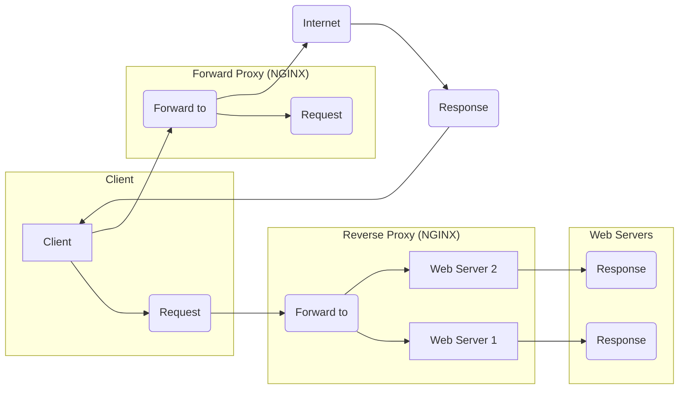

#  What is Nginx

> nginx [engine x] is an HTTP and reverse proxy server, a mail proxy server, and a generic TCP/UDP proxy server,



The diagram illustrates the flow of requests and responses in a setup involving NGINX serving as both a reverse proxy and a forward proxy:

### Reverse Proxy (NGINX)
- The client sends a request to the NGINX reverse proxy.
- NGINX forwards the request to one of the web servers (Web Server 1 or Web Server 2).
- The selected web server processes the request and sends a response back to the reverse proxy.
- The reverse proxy forwards the response back to the client.

### Forward Proxy (NGINX)
- The client sends a request to the NGINX forward proxy.
- NGINX forwards the request to the internet.
- The internet processes the request and sends a response back to the forward proxy.
- The forward proxy forwards the response back to the client.


## Example config reverse proxy
```bash
worker_processes 1;

events {
    worker_connections 1024;
}

http {
    server {
        listen 8080;

        # Define access control
        allow 192.168.1.0/24;
        deny all;

        location / {
            resolver 8.8.8.8;
            proxy_pass http://$http_host$request_uri;
            proxy_set_header Host $http_host;
            proxy_set_header X-Real-IP $remote_addr;
            proxy_set_header X-Forwarded-For $proxy_add_x_forwarded_for;
            proxy_set_header X-Forwarded-Proto $scheme;
            proxy_connect_timeout 5s;
            proxy_read_timeout 10s;
        }
    }
}
```


## Example config forward proxy

```bash

worker_processes 1;

events {
    worker_connections 1024;
}

http {
    server {
        listen 80;

        server_name example.com;

        location / {
            proxy_pass http://backend_server;
            proxy_set_header Host $host;
            proxy_set_header X-Real-IP $remote_addr;
            proxy_set_header X-Forwarded-For $proxy_add_x_forwarded_for;
            proxy_set_header X-Forwarded-Proto $scheme;
        }
    }
}

```