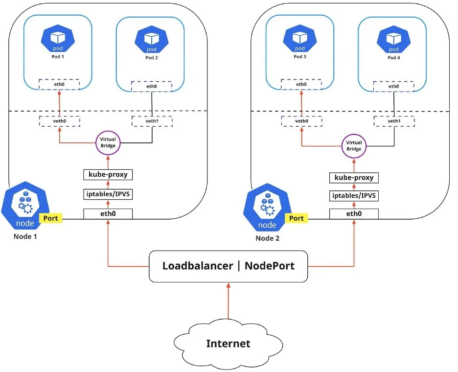

# Services, Load Balancing, and Networking

## Service 

Expose an application running in your cluster behind a single outward-facing endpoint, even when the workload is split across multiple backends.

Type of Services
1. ClusterIP: Exposes the Service on a cluster-internal IP. Choosing this value makes the Service only reachable from within the cluster. This is the default ServiceType.
2. NodePort: Exposes the Service on each Node's IP at a static port (the NodePort). A ClusterIP Service, to which the NodePort Service routes, is automatically created. You'll be able to contact the NodePort Service, from outside the cluster, by requesting <NodeIP>:<NodePort>.

3. LoadBalancer: Exposes the Service externally using a cloud provider's load balancer. NodePort and ClusterIP Services, to which the external load balancer routes, are automatically created.
4. ExternalName: Maps the Service to the contents of the externalName field (e.g. foo.bar.example.com), by returning a CNAME record with its value. No proxying of any kind is set up.

## Ingress 
Ingress exposes HTTP and HTTPS routes from outside the cluster to services within the cluster. Traffic routing is controlled by rules defined on the Ingress resource.

## Networking 
With Kubernetes, every node has a designated CIDR (Classless Inter-Domain Routing) range of IPs for Pods. This ensures that every Pod receives a unique IP address that other Pods in the cluster can see.

