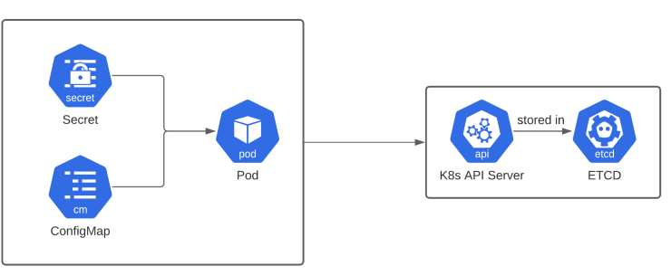

# Configuration

คือ API Object ประเภทหนึ่งของ kubernetes ทำหน้าที่เก็บค่า configuration ต่างๆ ที่ application จะนำไปใช้ โดยจะเก็บอยุ่ในรูปแบบของ `key: value` โดยจะแบ่งเป็น 2 ประเภทใหญ่ๆคือ



## 1. configmap
configmap จะเก็บข้อมุลประเภท  non-confidencial หรือก็คือไม่มีการเข้ารหัสข้อมูล นิยมเก็บพวก parameter หรือ arguments ต่างๆ โดย pod ที่ต้องการใช้งาน configmap จะทำการ mount volume แบบ PVC หรือการ consume ผ่าน environment variables

## 2. Secret 
เป็น configmap ประเภทการเข้ารหัส เหมาะสำหรับเก็บ password ต่างๆ

---
## Workshop
1. จงสร้าง Docker file  โดยกำหนด environment variables 

2. จงศึกษาและอธิบายคำสั่งต่อไปนี้

checkout lab
```bash
git clone -b sample-app-0 https://github.com/nukoolmu/public-laboratory.git
```

create kubernetes resource
```bash
kubectl apply -f public-laboratory/kubernetes-cm/
```