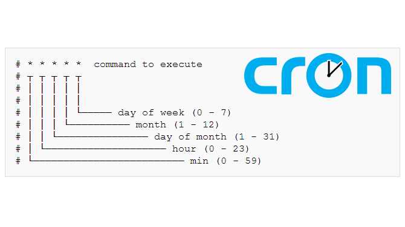

# Cronjob

เป็นการตั้ง cronjob ของ kubernetes โดยเมื่อถึงรอบเวลาที่กำหนด scheduler จะทำการ start pod ขึ้นมาเพื่อทำงาน



---
## Workshop

1. create linux cronjob แล้วอธิบาย

2. จงศึกษาและอธิบายคำสั่งต่อไปนี้

checkout lab
```bash
git clone -b sample-app-0 https://github.com/nukoolmu/public-laboratory.git
```
create kubernetes resource
```bash
kubectl apply -f public-laboratory/kubernetes-02/
```
Check the result
```bash
kubectl apply -f public-laboratory/kubernetes-02/
```