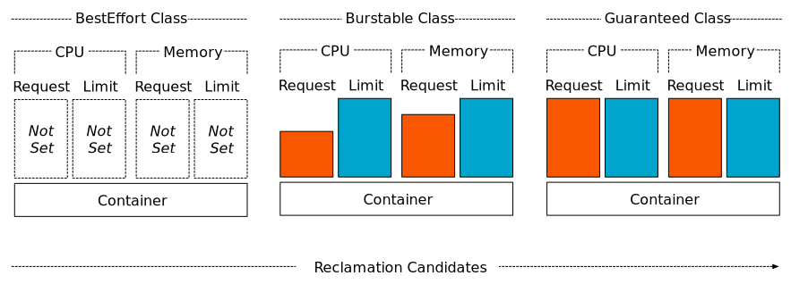

# Resource Management

คือการกำหนดให้ pod หรือ container ให้ CPU หรือ Memory ได้มากน้อยเท่าไหร่ และเมื่อเรากำหนด resource ให้ pod หรือ container ของเรา scheduler จะทำการเลือก node ที่มี resource (CPU/MEM) ของ node ที่เหมาะสมแก่การ spawn pod ใหม่ โดยจะพิจารณาจากค่า resource request เป็นอันดับแรก

## Requests and limits

Request คือการกำหนดว่า pod หรือ container จะให้ CPU หรือ memory เท่าไหร่ในการ start

Limit คือการกำหนดว่า หลังจาก pod หรือ container  start ขึ้นมาแล้วจะสามารถใช้ CPU หรือ memory ได้ไม่เกินเท่าไหร่ และถ้าหากเกิน pod นั้นจะถูกลบแล้วสร้างใหม่

## Resource units in Kubernetes

1 physical CPU core หรือ 1 virtual core, จะมีค่าเท่ากับ 1000 mili-cpu

ส่วน memory มีค่าเท่ากับเช่น 1GB เท่ากับ 1024mi

> นอกจากกำหนด CPU และ memory ยังสามารถกำหนดค่าของ ephemeral storage ได้อีกด้วย

---
## Workshop

1. จงอภิปรายข้อดีและข้อเสียของการกำหนด resource ให้ pod และ container