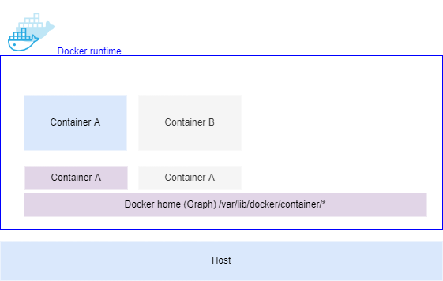
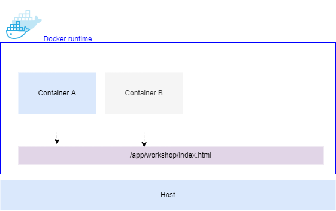

# Volumes

disk ใน container เรียกว่า ephemeral (หรือพื้นที่ชั่วคราว) เมื่อ container ถูกลบไป ephameral storage ก็จะถูก re-claim จากระบบ




kubernetes มี concept ที่จะเก็บ Data เอาไว้แม้ว่า จะถูกลบไปแล้วก็ตาม เรียกว่า Persistent Volume 


## Persistent Volume (PV)
เป็น resource ประเภทหนึ่งของ Cluster คล้ายๆ node เองที่เป็น resource ของ cluster, ทำหน้าที่ provision storage แบบ static หากต้องการ provision storage แบบ dynamic ต้องใช้ storage class ร่วมด้วย

## Persistent Volume Claim (PVC)
เป็น Resource ประเภทหนึ่งที่ทำหน้าที่ comsume PV อีกทีหนึ่ง โดยจะมี Pod consume PV ผ่าน PVC

---
## Workshop 

1. จงสร้าง nginx container  ขึ้นมา 2 อันแล้วทำการ mount Volume ไปที่ host Path : /app/workshop/
และอภิปราย



2. จงศึกษาและอธิบายคำสั่งต่อไปนี้

checkout lab
```bash
git clone -b sample-app-0 https://github.com/nukoolmu/public-laboratory.git
```

create kubernetes resource
```bash
kubectl apply -f public-laboratory/kubernetes/
```